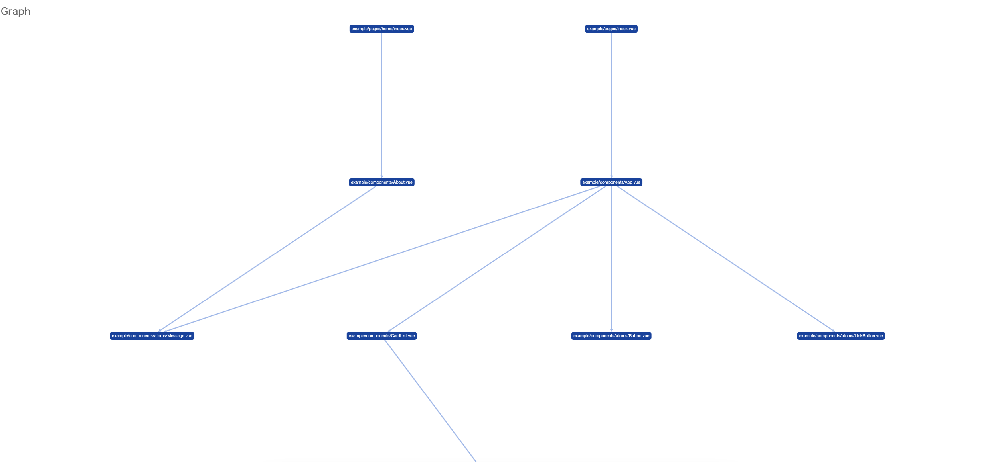

# Vurif

[](https://npmjs.com/package/vurif)
[](https://npmjs.com/package/vurif)

> Component dependency Analyzer for Vue.js 2.

*"Vue verifier"* : CLI tool to visualize dependencies by graph.

💡 **Epic Features:**

- Analyze dependency from a page(pages) through directory
- Visualize dependency by graph

> [!CAUTION]
> Works only Vue.js 2 (Not guarantee to work on Vue 3)

📒 **Key Concepts:**

- Vue/Nuxt projects often have view files in `views`, `pages` and components in `components`.
- Vurif loads starting from view files and resolves dependencies in `components` recursively.

> [!NOTE]
> Vurif assumes that component names in vue files match `components` file name.
> In the future, maybe able to parse much dynamic.

❗ **This project is under development.** Please pay attention to use this tool.

## Usage

### Install

```bash
# npm
npm i -g vurif

# yarn
yarn add -g vurif
```

### Analysis and Visualization

Analyze dependencies of one view file:

```bash
vurif load <vue-file> <components-dir>
# vurif load example/pages/index.vue example/components
```

Analyze dependencies of source root file:

```bash
vurif load-all <source-dir> <components-dir>
# vurif load-all example/pages/ example/components
```

Subcommands has only `load` currently. See also `vurif --help`

Vurif output dependency analysis by standard output or visual graph.

## Options

### `--format` / `-f`

*`graph`* (default)

Visualize dependency graph, served on local server.



*`stdout`*

Print graph to stdout.

```
index.vue
  <== About.vue
    <== Message.vue
index.vue
  <== App.vue
    <== Message.vue
    <== Button.vue
    <== LinkButton.vue
    <== CardList.vue
      <== Card.vue
```

`*report*`

Report degrees of graph elements and summary.

```
Node degrees:

  ----------------------------------------------------------
  | # | name                                    | indegree |
  ----------------------------------------------------------
  |1  |example/components/atoms/Message.vue     |         2|
  |2  |example/components/About.vue             |         1|
  |3  |example/components/App.vue               |         1|
  |4  |example/components/atoms/Button.vue      |         1|
  |5  |example/components/atoms/LinkButton.vue  |         1|
  |6  |example/components/CardList.vue          |         1|
  |7  |example/components/Card.vue              |         1|
  |8  |example/pages/home/index.vue             |         0|
  |9  |example/pages/index.vue                  |         0|
  ----------------------------------------------------------

------------------------------------------------------------
Summary:

  🔸 Total nodes: 10
  ➣  Total edges: 8

```

## Development

Requirements: Node.js >=18

- Enable corepack: `corepack enable`
- Install dependencies: `pnpm install`
- Execute locally: `pnpm dev load example/App.vue example/`
